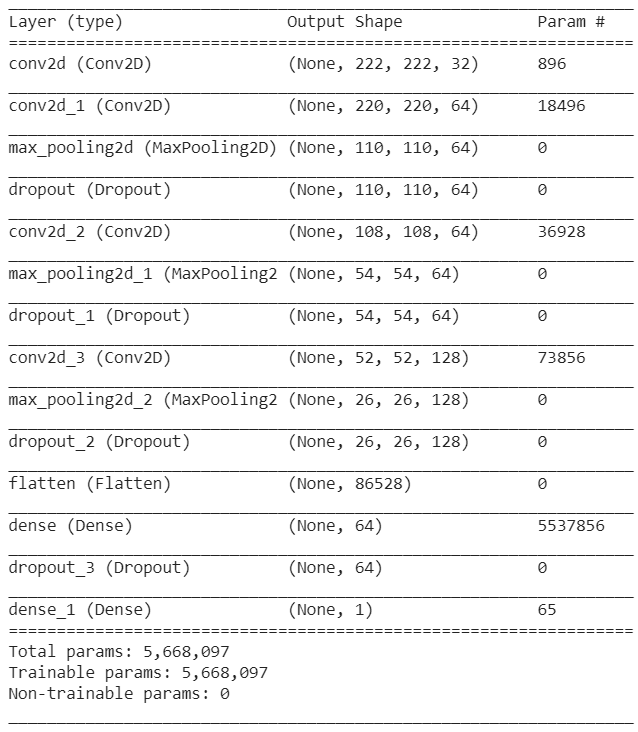
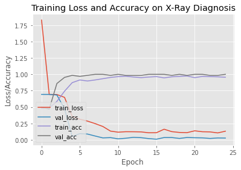
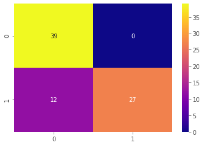

## Identification of COVID-19 using X-Rays

This repository is an attempt to identify potentital COVID-19 cases using X-Rays as a decisive medium.

### Architecture

The model is built on a custom CNN architecture (displayed below) with over 392 useful images in total from a dataset of over 1000+ X-Ray Images.

### Project Execution

1. Open the `Terminal`.
2. Clone the repository by entering `https://github.com/pranay-ar/Identification-of-COVID-19-Using-X-Rays`.
3. Ensure that `Python3` and `pip`/`conda` is installed on the system.
4. Create a `virtualenv` by executing the following command: `virtualenv -p python3 env`.
5. Activate the `env` virtual environment by executing the follwing command: `source env/bin/activate`.
6. Enter the cloned repository directory and execute `pip install -r requirements.txt`.
7. The entire code and the data extraction process can be found in the Jupyter Notebooks available in the repository

### Performance Overview

### Miscellaneous

The dataset has been acquired from Dr. Jospeh Paul Cohen's Github Repository [link](https://github.com/ieee8023/covid-chestxray-dataset)

`COVID-19 Image Data Collection: Prospective Predictions Are the Future`
`Joseph Paul Cohen and Paul Morrison and Lan Dao and Karsten Roth and Tim Q Duong and Marzyeh Ghassemi`
`arXiv:2006.11988, https://github.com/ieee8023/covid-chestxray-dataset, 2020`